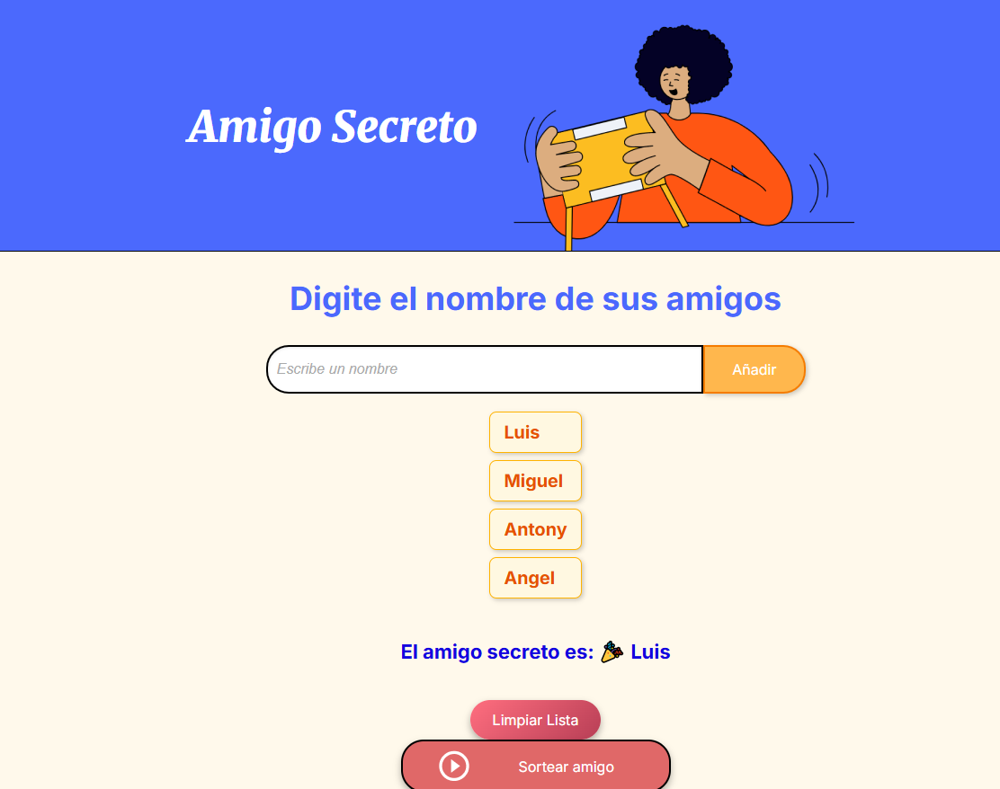

# Desafio Del Amigo Secreto
"Este proyecto fue creado como parte de un desafío de programación para practicar mis habilidades en desarrollo web Actualmente, estás viendo la versión final del proyecto."

## Funcionalidades 
- Agregar amigos

- Seleccionar a un amigo de la lista para que sea tu amigo secreto

## Lenguajes y herramientas de desarrollo  
  
  
  
  
  

## Autor

- Diego Joel Mamani Perez 

## Contacto 

